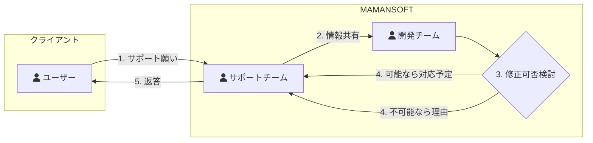
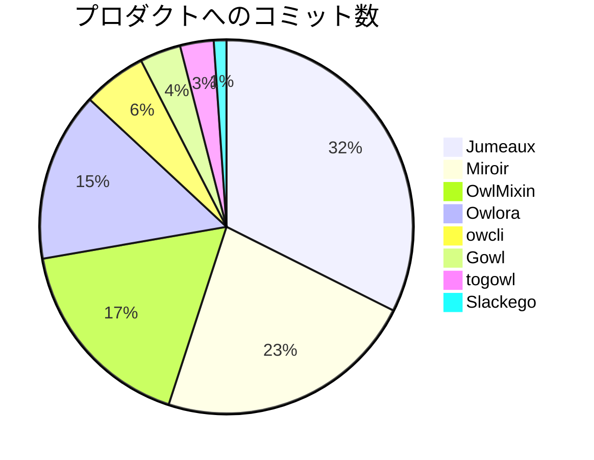
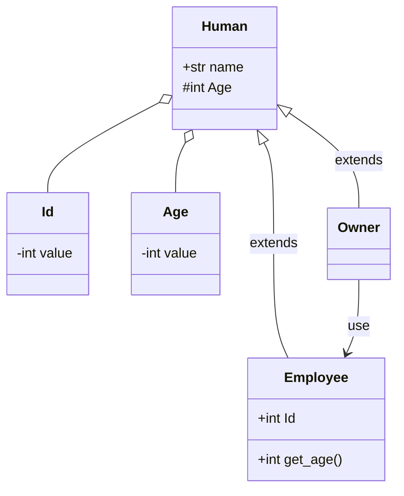
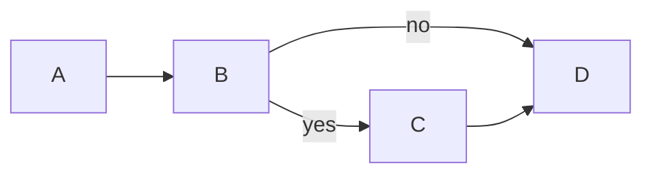

Markdownベースのドキュメントやブログで気軽に図を描くため、[mermaid]を試してみました。

<!--more-->


<!--toc-->


mermaidとは
-----------

Markdownのような記述で図、表、グラフなどを記載できるJavaScriptライブラリです。  
`JS Open Source Awards 2019`の`The Most Exciting Use of Technology`に選ばれています。




向いているケース
----------------

🙆‍♂ 以下のケースに向いていると思います。

* 図の体裁には拘らないけど、文字で説明するより図を使いたい
* Gitでバージョン管理したい
* Markdownと同じドキュメント内で図を描きたい

🙅‍♂ 逆に以下のケースには向かないと思います。

* 図の体裁に拘りたい
* Markdownのような文章表現が嫌い


よく使うもの
------------

対応している仕様は公式サイトをご覧下さい。



ここでは私がよく使うモノのみピックアップします。


### フローチャート

処理の流れを説明するのにとても便利なフローチャートの書き方です。

例として以下のパーツを含んだものを紹介します。

* ブロック
* 矢印
* テキスト付き矢印
* 条件分岐
* リンク埋め込み
* アイコン
* サブグラフ

#### 記載例





#### 出力


graph LR;
  subgraph クライアント
    usr[fa:fa-user ユーザー]
  end
  subgraph MAMANSOFT
    sup[fa:fa-user サポートチーム]
      click sup "http://blog.mamansoft.net/"
    dev[fa:fa-user 開発チーム]
    usr --> |1. サポート願い| sup;
    sup --> |2. 情報共有| dev
    dev --> c1{3. 修正可否検討}
      c1 --> |4. 可能なら対応予定| sup
      c1 --> |4. 不可能なら理由| sup
    sup --> |5. 返答| usr
  end



fontawesomeのCSSを読み込む必要があります。  
読みこみ方は使用する環境やツールに依存します。


### パイチャート

データの割合を可視化するのに適したパイチャートの書き方です。

#### 記載例





#### 出力


pie title プロダクトへのコミット数
  "Jumeaux": 946
  "Miroir": 661
  "OwlMixin": 504
  "Owlora": 428
  "owcli": 161
  "Gowl": 104
  "togowl": 85
  "Slackego": 32



### クラス図

コードの設計を説明するのに便利なクラス図の書き方です。

#### 記載例





#### 出力


classDiagram
  class Human {
    +str name
    #int Age
  }

  class Id { -int value }
  class Age { -int value }
  class Owner
  class Employee {
    +int Id

    +int get_age()
  }

  Human <|-- Owner : extends
  Human <|-- Employee : extends
  Human o-- Id
  Human o-- Age
  Owner --> Employee : use



導入方法
--------



以下2つのケースについて紹介します。

1. VS Code
2. [Hugo]


### VS Code

markdown-mermaidという拡張をインストールします。



#### 記載例

````

````

#### 出力例



CSSで見た目は変更できると思います。


### Hugo

[Hugo]は静的サイトジェネレーターです。  
このブログも[Hugo]で作っています。

今回はshortcodesという仕組みを使って、mermaidの描画を実現しています。  
`shortcodes/mermaid.html`を作るだけで準備はOKです。

```html
<script src="https://unpkg.com/mermaid@8.4.4/dist/mermaid.min.js"></script>
<div class="mermaid">
  {{.Inner}}
</div>
```

あとは本文中に挿入します。

#### 記載例

```

graph LR;
  A --> B
  B --> | yes | C
  B --> | no  | D
  C --> D

```

#### 出力例

画像ではなく本記事をmermaidでそのままパースした結果です。


graph LR;
  A --> B
  B --> | yes | C
  B --> | no  | D
  C --> D



総括
----

Markdownで図表を作成できる[mermaid]を紹介しました。  
普段のメモ書きではVS Codeと、アウトプットとして発信する情報には[Hugo]と連携して活用しています。

HTML/Markdownを使ったスライド作成ツールで図を作成したいケースが多いため、[backslide]などのツール上でも使ってみたいです😄  
使い方が分かったら追記してみます👍

[mermaid]: https://github.com/mermaid-js/mermaid
[Hugo]: https://gohugo.io/
[backslide]: https://github.com/sinedied/backslide
