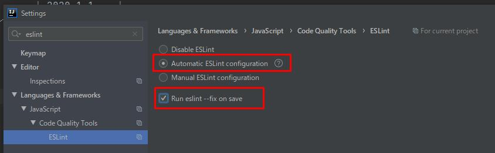

Intellij IDEAでファイル保存時に、ESLintとPrettierを自動実行してファイルを自動的に整形するようにしました。  
ESLintは可能であればAuto fix (`--fix`) します。

<!--more-->



<!--toc-->


はじめに
--------

### 前提知識

* [ESLint]
* [Prettier]
* [IntelliJ IDEA]

[ESLint]: https://eslint.org/
[Prettier]: https://prettier.io/
[IntelliJ IDEA]: https://www.jetbrains.com/ja-jp/idea/


上記3つの知識については、このブログの過去記事でも紹介しています。  
よろしければあわせてご覧下さい。

* 
* 
* 


### 確認バージョン

自動保存機能は最近実装された機能であるため、下記以上のバージョンでお試しください。

| 項目               | バージョン  |
| ------------------ | ----------- |
| IntelliJ IDEA      | 2020.1.1    |
| Prettierプラグイン | 201.7223.99 |


ESLintの設定
------------

`Language & Frameworks` > `JavaScript` > `Code Quality Tools` > `ESLint` の設定を変更します。



`Run eslint --fix on save`が有効なら、Auto fix可能な項目はファイルが自動的に修正されます。


Prettierの設定
--------------

はじめにPrettierプラグインをインストールします。



`Language & Frameworks` > `JavaScript` > `Prettier`の設定を変更します。


デフォルトでは以下の拡張子が対象です。

* `js`
* `jsx`
* `ts`
* `tsx`

他の拡張子も対象にする場合は`Run on save for files`の内容を変更してください。  
たとえば、vueファイルを対象に加える場合は以下のようにします。

```
{**/*,*}.{js,ts,jsx,tsx,vue}
```


IDEAVimの保存時には反映されない
-------------------------------

IntelliJ IDEAでIdeaVimプラグインを使っている方に注意です。



IdeaVimから`:w<CR>`で保存した場合、ファイルの自動修正は行われません。



回避策は3つあります。

* IDEAの保存コマンドを使う
* `:wa<CR>`で保存する
* [File Watchersプラグインを使う](https://blog.mamansoft.net/2019/08/08/only-use-prettier-typescript-auto-format/#intellij-idea%E3%81%AE%E8%A8%AD%E5%AE%9A)

せっかく公式対応されたので、File Watchersプラグインを使わずに順応したいですね。


IdeaVimの`:w`コマンドは別の機能でも同様の問題が発生するようです。

IDEAを使うときは、この機会に`:w`から卒業したほうがいいかもしれません。



先日以下の記事を書きましたので、よろしければご覧下さい。




総括
----

ファイル保存時にESLint(`--fix`)とPrettierを自動実行する方法を紹介しました。

必ず修正するLintエラーやフォーマットに気を遣うのはリソースの無駄です。  
脳のリソースは設計や実装などに使っていきたいですね😉
