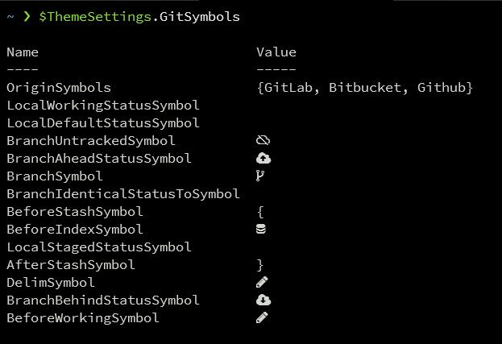

[Windows Terminal]と[PowerShell]を使って、COOLなターミナル環境を構築してみました。

<!--more-->



<!--toc-->


はじめに
--------

先日、Windows Terminalのバージョン1.0がリリースされました。



以前は状況に応じて、ツールを使い分けていました。

| 使っていたもの | 状況                                                 |
| -------------- | ---------------------------------------------------- |
| [Cmder]        | 一般的なターミナル操作(コマンドプロンプトを使うもの) |
| [git bash]     | Linuxコマンドを使ってShell Scriptを実行するとき      |
| [wsl-terminal] | Linux(SSH含む)の操作                                 |

今回の対応でこれらをすべて[Windows Terminal]に統一することができました。

### 以前の記事

本記事では[Cmder]や[git bash]、[wsl-terminal]の説明はしません。  
なぜ、それらを利用していたかは過去の記事をご覧ください。



#### Cmder





#### git bash



#### fish





### 想定する読者

以下のような方を想定しています。

* WindowsでLinuxのようにターミナルを快適に使いたい
* WSL Terminalやgit bash、Cmderを使っているが満足できていない
* Windows Terminalを使いこなしたい
* Windowsのコマンドプロンプトを哀れみの目で見てくるMac/Linuxユーザを見返したい


ターミナルに求める要件
----------------------

私がターミナルに求める要件はいくつかあります。  
今まで使っていたツールで要件を満たせていたかを列挙します。

※ [Cmder]はcmd.exeを、[git bash]と[wsl-terminal]はbashを起動する前提

| 要件                                      | [Cmder]  | [git bash] | [wsl-terminal] |
| ----------------------------------------- | -------- | ---------- | -------------- |
| Windowsのファイルシステムをそのまま使える | 〇       | ▲         | ▲(重い)       |
| Windowsで動作保証されているコマンドが動く | 〇       | ▲         | ▲             |
| Linuxコマンドが使える                     | 〇       | 〇         | ◎             |
| Linuxサーバで文字化けしない               | ▲       | 〇         | ◎             |
| GitをPowerLine表示できる                  | 〇(重い) | ▲(重い)   | 〇(重い)       |
| Unicode絵文字が表示できる                 | ▲       | 〇         | 〇             |
| 画面を分割できる                          | 〇       | ×         | ×             |
| 複数タブ表示できる                        | ◎       | ×         | ×             |
| 背景に画像を表示できる                    | ◎       | ×         | ×             |
| 履歴からcdできる                          | ▲       | ×         | 〇             |
| リポジトリにcdできる                      | 〇       | ×         | 〇             |


なぜWindows Terminalなのか
--------------------------

理由は2つあります。

❶ Microsoftが公式で開発している  
❷ 必要な要件をほぼ全て満たしている

### Microsoftが公式で開発している

Windows OSを開発しているのはMicrosoftです。  
そのMicrosoftが開発しているため、将来性は抜群でしょう😁

別の言い方をすると、リスク回避とも言えます。  
数年後には、他のOSSターミナルは軒並み開発が停止している可能性がありますので。

### 必要な要件をほぼ全て満たしている

今回試して分かったことでもありますが、私にとって必要な要件をほぼ全て満たしていました。  
先ほどの要件表に照らし合わせると、以下のようになります。

| 要件                                      | [Windows Terminal] + [PowerShell] |
| ----------------------------------------- | --------------------------------- |
| Windowsのファイルシステムをそのまま使える | ◎                                |
| Windowsで動作保証されているコマンドが動く | ◎                                |
| Linuxコマンドが使える                     | ▲                                |
| Linuxサーバで文字化けしない               | ◎                                |
| GitをPowerLine表示できる                  | 〇 (Linuxには負けるが実用的速さ)  |
| Unicode絵文字が表示できる                 | ◎                                |
| 画面を分割できる                          | ◎                                |
| 複数タブ表示できる                        | ◎                                |
| 背景に画像を表示できる                    | ◎                                |
| 履歴からcdできる                          | 〇                                |
| リポジトリにcdできる                      | 〇                                |

[PowerShell]を使う唯一?の弊害として、Linuxコマンドは使いにくくなります。  
しかし、それさえ許容出来れば全てが統一できるわけです..🆒!!

※ 他にも問題はありますが、それは後ほど紹介します


Windows Terminal
----------------

ここからは[Windows Terminal]のインストール方法や設定の話をします。

### インストール

公式が推奨しているので、Microsoft Storeからインストールしました。



### 設定

GUIのメニューから設定を選ぶと、VS Codeなどのエディタで設定ファイルが開きます。



私は以下のように設定しています。  
設定項目のドキュメントは、ファイル内 👀のURLをご覧下さい。



```javascript
// 👀 https://docs.microsoft.com/ja-jp/windows/terminal/customize-settings/global-settings
{
  "$schema": "https://aka.ms/terminal-profiles-schema",

  "defaultProfile": "{61c54bbd-c2c6-5271-96e7-009a87ff44bf}",
  // 格好いいのでテーマはdark
  "theme": "dark",
  "copyOnSelect": false,
  "copyFormatting": false,

  // 👀 https://docs.microsoft.com/ja-jp/windows/terminal/customize-settings/profile-settings
  "profiles": {
    "defaults": {
      "closeOnExit": "always",
      "startingDirectory": "%USERPROFILE%",
      // Nerd Fontを指定
      "fontFace": "SauceCodePro NF",
      "fontSize": 13,
      // 格好良いから
      "colorScheme": "Tango Dark",
      // 背景画像は右端に
      "backgroundImageStretchMode": "uniform",
      "backgroundImageAlignment": "right"
    },
    // 実行するシェルの一覧
    "list": [
      // PowerShellがメイン
      {
        "guid": "{61c54bbd-c2c6-5271-96e7-009a87ff44bf}",
        "name": "Windows PowerShell",
        "icon": "https://avatars3.githubusercontent.com/u/9500018?s=460&u=409f92af80796e5d70aff0d97cfbcfc9031cb620&v=4",
        "backgroundImage": "%USERPROFILE%\\Pictures\\terminal\\linux-background.jpg"
      },
      // WSLをたまに使う
      {
        "guid": "{2c4de342-38b7-51cf-b940-2309a097f518}",
        "name": "Ubuntu",
        "source": "Windows.Terminal.Wsl",
        "backgroundImage": "%USERPROFILE%\\Pictures\\terminal\\linux-tux.png"
      },
      // git bashもshellの動作確認用に使うことがある
      {
        "guid": "{cbaea444-ca1f-4125-bb6f-5c3f1201b568}",
        "name": "git bash",
        "startingDirectory": "%USERPROFILE%",
        "commandline": "C:\\Program Files\\Git\\bin\\bash.exe",
        "icon": "C:\\Program Files\\Git\\mingw64\\share\\git\\git-for-windows.ico"
      },
      // コマンドプロンプトとCmderは基本使わないので hidden: true で非表示にする
      {
        "guid": "{0caa0dad-35be-5f56-a8ff-afceeeaa6101}",
        "name": "コマンド プロンプト",
        "commandline": "cmd.exe",
        "hidden": true
      },
      {
        "guid": "{cae41f3b-63b9-47a2-a091-cfc530ccdc6b}",
        "name": "Cmder",
        "backgroundImage": "c:\\tools\\Cmder\\config\\fukurou.jpg",
        "commandline": "cmd.exe /k C:\\tools\\Cmder\\vendor\\init.bat",
        "hidden": true
      },
      {
        "guid": "{b453ae62-4e3d-5e58-b989-0a998ec441b8}",
        "hidden": false,
        "name": "Azure Cloud Shell",
        "source": "Windows.Terminal.Azure"
      }
    ]
  },

  // 👀 https://docs.microsoft.com/ja-jp/windows/terminal/customize-settings/color-schemes
  "schemes": [],

  // 👀 https://docs.microsoft.com/ja-jp/windows/terminal/customize-settings/key-bindings
  "keybindings": [
    // 基本操作
    { "command": { "action": "copy", "singleLine": false }, "keys": "ctrl+c" },
    { "command": "paste", "keys": "ctrl+v" },
    { "command": "find", "keys": "ctrl+alt+f" },

    // 画面スクロール
    { "command": "scrollUp", "keys": "shift+up" },
    { "command": "scrollDown", "keys": "shift+down" },
    { "command": "scrollUpPage", "keys": "shift+pgup" },
    { "command": "scrollDownPage", "keys": "shift+pgdn" },

    // タブ
    { "command": "newTab", "keys": "ctrl+t" },
    { "command": "closeTab", "keys": "ctrl+w" },
    { "command": "nextTab", "keys": "alt+l" },
    { "command": "prevTab", "keys": "alt+h" },

    // ペインの分割
    {
      "command": {
        "action": "splitPane",
        "split": "auto",
        "splitMode": "duplicate"
      },
      "keys": "alt+shift+d"
    },
    // ペイン移動
    {
      "command": { "action": "moveFocus", "direction": "down" },
      "keys": "alt+ctrl+j"
    },
    {
      "command": { "action": "moveFocus", "direction": "left" },
      "keys": "alt+ctrl+h"
    },
    {
      "command": { "action": "moveFocus", "direction": "right" },
      "keys": "alt+ctrl+l"
    },
    {
      "command": { "action": "moveFocus", "direction": "up" },
      "keys": "alt+ctrl+k"
    },
    // ペインサイズ変更
    {
      "command": { "action": "resizePane", "direction": "down" },
      "keys": "alt+shift+j"
    },
    {
      "command": { "action": "resizePane", "direction": "left" },
      "keys": "alt+shift+h"
    },
    {
      "command": { "action": "resizePane", "direction": "right" },
      "keys": "alt+shift+l"
    },
    {
      "command": { "action": "resizePane", "direction": "up" },
      "keys": "alt+shift+k"
    }
  ]
}
```





guidの生成方法は以下を参考にさせていただきました。  
この記事はCmderのexeをWindows Terminalで動かすことがメインです。



当初はPowerShellを使わずに、Windows TerminalでCmderを動かすつもりでした。  
Power Shellに乗り換えた一番の理由は、コマンドの反応速度です。



画面イメージはこんな感じです。



GitHubでも設定を公開しています。よろしければご覧下さい。




本記事で設定したフォントはデフォルトでインストールされていない特殊なフォントです。  
後ほどインストール方法を紹介しますので、そちらをご覧下さい。



筆者のLocalだけに存在する画像ファイルのパスを指定しているためです。  
`icon`と`backgroundImage`は自分で使用したい画像ファイルのパスへ置き換えて下さい。



なぜPowerShellなのか
--------------------

[Windows Terminal]の設定が終わったので、ここからは[PowerShell]の話をしていきます。  
まずは採用した理由について..理由は3つあります。

❶ Windows標準  
❷ 見た目をかなりカスタマイズできる  
❸ Cmder.exeよりコマンド実行速度が速い  


### Windows標準 

[PowerShell]はWindowsに標準でインストールされています。  
しかも、最近の推奨シェルは[PowerShell]となっています。

※ 一昔前は`cmd.exe`が主流でした

Windowsとの相性を考えると、最もベストな選択肢と言えるでしょう。

### 見た目をかなりカスタマイズできる

[oh-my-posh]というテーマエンジンを使うと、見た目をかなりカスタマイズできます。  
これは、コマンドプロンプトと比べて大きなメリットでしょう😄



以下が[oh-my-posh]を適応して、Gitリポジトリを操作したイメージ画像です。  
テーマは`Set-Theme Powerlevel10k-Lean`を使っています。



絵文字は後ほど紹介する設定でカスタマイズしています。


### Cmder.exeよりコマンド実行速度が速い

Windowsではコマンドプロンプト/PowerShell以外のシェルを使うと、exe呼び出しか通信のオーバーヘッドがかなりかかっている気がします。  
たとえば、現在のリポジトリ状況を示すPowerlineの表示速度を比較するとこれだけ差が出ます。

| ツール                          | 表示速度の目安 |
| ------------------------------- | -------------- |
| [Windows Terminal]+[PowerShell] | 0.2秒          |
| [Windows Terminal]+[git bash]   | 2秒            |
| [Windows Terminal]+[Cmder]      | 1秒            |

Enterを押してから情報が表示されるまでのラグを比べてみると一目瞭然です。



私が[PowerShell]を採用する決め手となったのが、この速度差というわけです👍


PowerShell
----------

それでは、[PowerShell]の準備をしていきましょう。

### セットアップ

jMicrosoftの公式ページを参考にします。



[PowerShell]を起動して、以下のコマンドを実行します。

```powershell
Install-Module posh-git -Scope CurrentUser -Force
Install-Module oh-my-posh -Scope CurrentUser -Force
# PowerShell Coreを使用している場合
Install-Module -Name PSReadLine -Scope CurrentUser -Force -SkipPublisherCheck
```

### フォントのインストール

Powerlineの表示には、アイコンに対応した特殊なフォントが必要です。  
メジャーなアイコンほぼ全てに対応済みである[Nerd Fonts]を使います。



`Download`をクリックしてダウンロードします。  
私は`Source Code Pro`が好きなので、`Sauce Code Pro Nerd Font`にしました。

解凍をしたら、インストールしたいフォントをダブルクリックします。  
私は以下をインストールしました。

* `Sauce Code Pro Nerd Font Complete Windows Compatible.ttf`
* `Sauce Code Pro Bold Nerd Font Complete Windows Compatible.ttf`
* `Sauce Code Pro Semibold Nerd Font Complete Windows Compatible.ttf`

これらを使うには[Windows Terminal]の設定で`fontFace`に指定する必要があります。  
先ほどの設定例には既に記載されています。

```
"fontFace": "SauceCodePro NF"
```


### プロファイルの設定

[PowerShell]を起動して以下のコマンドを実行します。

```
notepad $PROFILE
```

プロファイルが開きますので、必要な設定を記載します。

```powerline
Import-Module posh-git
Import-Module oh-my-posh
Set-Theme Paradox
```

[PowerShell]を再起動すれば表示が変わると思います。


私のprofileファイルは以下です。



```powershell
#-----------------------------------------------------
# Env
#-----------------------------------------------------

# パイプで渡したときに文字化けで処理が上手く行かない問題を回避するため
$utf8 = [System.Text.Encoding]::GetEncoding("utf-8")
$OutputEncoding = $utf8
[System.Console]::OutputEncoding = $utf8

# git logなどのマルチバイト文字を表示させるため (絵文字含む)
$env:LESSCHARSET = "utf-8"

# Git Bash配下のMinGW系コマンドが使えるなら使う
$env:PATH += ";C:\Program Files\Git\usr\bin"


#-----------------------------------------------------
# Powerline
#-----------------------------------------------------

Import-Module posh-git
Import-Module oh-my-posh
Set-Theme Powerlevel10k-Lean

# Prompt
$ThemeSettings.Colors.DriveForegroundColor = "Blue"
# Git
$ThemeSettings.GitSymbols.LocalStagedStatusSymbol = ""
$ThemeSettings.GitSymbols.LocalWorkingStatusSymbol = ""
$ThemeSettings.GitSymbols.BeforeWorkingSymbol = [char]::ConvertFromUtf32(0xf040)+" "
$ThemeSettings.GitSymbols.DelimSymbol = [char]::ConvertFromUtf32(0xf040)
$ThemeSettings.GitSymbols.BranchSymbol = [char]::ConvertFromUtf32(0xf126)
$ThemeSettings.GitSymbols.BranchAheadStatusSymbol = [char]::ConvertFromUtf32(0xf0ee)+" "
$ThemeSettings.GitSymbols.BranchBehindStatusSymbol = [char]::ConvertFromUtf32(0xf0ed)+" "
$ThemeSettings.GitSymbols.BeforeIndexSymbol = [char]::ConvertFromUtf32(0xf6b7)+" "
$ThemeSettings.GitSymbols.BranchIdenticalStatusToSymbol = ""
$ThemeSettings.GitSymbols.BranchUntrackedSymbol = [char]::ConvertFromUtf32(0xf663)+" "

#-----------------------------------------------------
# fzf
#-----------------------------------------------------

# fzf
$env:FZF_DEFAULT_OPTS="--reverse --border --height 50%"
$env:FZF_DEFAULT_COMMAND='fd -HL --exclude ".git" .'
function _fzf_compgen_path() {
  fd -HL --exclude ".git" . "$1"
}
function _fzf_compgen_dir() {
  fd --type d -HL --exclude ".git" . "$1"
}


#-----------------------------------------------------
# Alias
#-----------------------------------------------------

# Linux like (WSLの場合は日本語問題に遭遇しにくい。ただしpipeを使わない場合)
Remove-Item alias:cat
Remove-Item alias:rm
function ll() { wsl ls -l $args }

# cd
function cdg() { gowl list | fzf | cd }
function cdr() { fd -H -t d -E .git -E node_modules | fzf | cd }
function cdz() { z -l | oss | select -skip 3  | % { $_.Trim().Split(" *")[1] } | fzf | cd }

# git flow
function gf()  { git fetch --all }
function gd()  { git diff $args }
function ga()  { git add $args }
function gaa() { git add --all }
function gco() { git commit -m $args[0] }

# git switch
function gb()  { git branch -l | rg -v '^\* ' | % { $_ -replace " ", "" } | fzf | % { git switch $_ } }
function gbr() { git branch -rl | rg -v "HEAD|master" | % { $_ -replace "  origin/", "" } | fzf | % { git switch $_ } }
function gbc() { git switch -c $args[0] }
function gbm()  { git branch -l | rg -v '^\* ' | % { $_ -replace " ", "" } | fzf | % { git merge --no-ff $_ } }

# git log
function gls()   { git log -3}
function gll()   { git log --oneline --all --graph --decorate }
function glll()  { git log --graph --all --date=format:'%Y-%m-%d %H:%M' --pretty=format:'%C(auto)%d%Creset\ %C(yellow)%h%Creset %C(magenta)%ae%Creset %C(cyan)%ad%Creset%n%C(white bold)%w(80)%s%Creset%n%b' }
function glls()  { git log --graph --all --date=format:'%Y-%m-%d %H:%M' --pretty=format:'%C(auto)%d%Creset\ %C(yellow)%h%Creset %C(magenta)%ae%Creset %C(cyan)%ad%Creset%n%C(white bold)%w(80)%s%Creset%n%b' -10}

# git status
function gs()  { git status --short }
function gss() { git status -v }

```



GitHubでも設定を公開しています。よろしければご覧下さい。




以降の章で紹介していきます。


### 文字コードをUTF-8に寄せる

文字コードを極力統一するのはとても大事です。  
いくつか制約はありますが、極力UTF-8として扱えるようprofileに設定します。

```powershell
# パイプで渡したときに文字化けで処理が上手く行かない問題を回避するため
$utf8 = [System.Text.Encoding]::GetEncoding("utf-8")
$OutputEncoding = $utf8
[System.Console]::OutputEncoding = $utf8

# git logなどのマルチバイト文字を表示させるため (絵文字含む)
$env:LESSCHARSET = "utf-8"
```

### Linuxコマンドをできるだけ使えるようにする

[git bash]にコマンドが同梱されていますのでPATHを通します。

```powershell
# Git Bash配下のMinGW系コマンドが使えるなら使う
$env:PATH += ";C:\Program Files\Git\usr\bin"
```

PowerShellとコマンド名が同じだが、Linuxコマンドを優先にしたい場合は無効にします。  
ただし、pipeを通すとうまく動かないので注意して下さい。

```powershell
# Linux like (WSLの場合は日本語問題に遭遇しにくい。ただしpipeを使わない場合)
Remove-Item alias:cat
Remove-Item alias:rm
```

また、PowerShellの`ll (ls- l)`は表示が遅いので、`function`としてWSLの`ls -l`コマンドを呼び出すようにしています。  
WSLで扱うパスの区切り文字は`/`なので文字列置換が必要です。

```powershell
function ll() {
  if ($args -ne "") {
    wsl ls -l $args.Replace("\", "/")
  } else {
    wsl ls -l
  }
}
```

### アイコン設定

主にGitのステータス表示で使われるアイコンをカスタマイズします。



profileの以下で設定しています。

```powershell
$ThemeSettings.GitSymbols.LocalStagedStatusSymbol = ""
$ThemeSettings.GitSymbols.LocalWorkingStatusSymbol = ""
$ThemeSettings.GitSymbols.BeforeWorkingSymbol = [char]::ConvertFromUtf32(0xf040)+" "
$ThemeSettings.GitSymbols.DelimSymbol = [char]::ConvertFromUtf32(0xf040)
$ThemeSettings.GitSymbols.BranchSymbol = [char]::ConvertFromUtf32(0xf126)
$ThemeSettings.GitSymbols.BranchAheadStatusSymbol = [char]::ConvertFromUtf32(0xf0ee)+" "
$ThemeSettings.GitSymbols.BranchBehindStatusSymbol = [char]::ConvertFromUtf32(0xf0ed)+" "
$ThemeSettings.GitSymbols.BeforeIndexSymbol = [char]::ConvertFromUtf32(0xf6b7)+" "
$ThemeSettings.GitSymbols.BranchIdenticalStatusToSymbol = ""
$ThemeSettings.GitSymbols.BranchUntrackedSymbol = [char]::ConvertFromUtf32(0xf663)+" "
```

`[char]::ConvertFromUtf32(...)`の引数に好きなアイコンを設定しましょう。  
アイコンのコードポイントは[Nerd Fonts]のCheat Sheetで確認できます。



`[char]::ConvertFromUtf32(...)`のあとに`+" "`しているのは、ターミナルが全角/半角を誤認してレイアウトが崩れるのを防ぐためです。

ステータスのアイコンは`$ThemeSettings.GitSymbols`で確認できます。



### fzfとの連携

[Cmder]を使っていたときは、独自Luaスクリプトで[fzf]と連携するコマンドを使っていました。  
下記の`cdg`, `cdz`, `cdr`相当のことをできるようにします。



[fzf]以外にも、コマンドによってツールのインストールが必要です。

| コマンド | 依存しているツール | インストール方法の一例                                              |
| -------- | ------------------ | ------------------------------------------------------------------- |
| cdr      | [fd]               | [Scoop]                                                             |
| cdz      | [z]                | [PowerShell Gallery](https://www.powershellgallery.com/packages/z/) |
| cdg      | [gowl]             | go get                                                              |

profileにワンライナーのfunctionを定義すればOKです。

```powershell
function cdg() { gowl list | fzf | cd }
function cdr() { fd -H -t d -E .git -E node_modules | fzf | cd }
function cdz() { z -l | oss | select -skip 3  | % { $_.Trim().Split(" *")[1] } | fzf | cd }
```

pipeで`cd`すると移動できるのは非常に🆒ですね！


課題
----

見た目もパフォーマンスも素晴らしい[Windows Terminal] x [PowerShell]ですが課題もあります。

### 標準出力/リダイレクトするとおかしくなる


### Linuxコマンドとの相性が悪い


### 絵文字が入力できない(PowerShell)

Local VMはWSLからいったほうがいい。絵文字も完璧
PowerShellからだと絵文字がダメ

トラブルシューティング
----------------------

### profileに記載された設定が部分的に反映されない

profileが **CRLF改行** になっていることを確認してください。

### sshすると posix_spawn: No such file or directory

`.ssh/config`で`ProxyCommand`を設定している場合、`ssh.exe`のパスを絶対パスにしてください。

`例`
```
ProxyCommand    C:\Windows\System32\OpenSSH\ssh.exe -W %h:%p server
```

参考: https://serverfault.com/questions/956613/windows-10-ssh-proxycommand-posix-spawn-no-such-file-or-directory


### Vimの文字コード/改行コードが推論されない

`.vimrc`に以下を記載してください。

```vim
" 文字コード自動判別
:set encoding=utf-8
:set fileencodings=iso-2022-jp,euc-jp,sjis,utf-8
" 改行コード自動判別
:set fileformats=unix,dos,mac
```

### VimのBEEP音を消したい

`.vimrc`に以下を記載してください。

```vim
" 音を鳴らさない
:set belloff=all
```

### Vimのクリップボードとyankが同期しない

`.vimrc`に以下を記載してください。

```vim
" Clipboard同期
set clipboard+=unnamed
```


[Windows Terminal]: https://docs.microsoft.com/ja-jp/windows/terminal/
[PowerShell]: https://docs.microsoft.com/en-us/powershell/
[Cmder]: https://cmder.net/
[git bash]: https://gitforwindows.org/
[wsl-terminal]: https://github.com/mskyaxl/wsl-terminal
[oh-my-posh]: https://github.com/JanDeDobbeleer/oh-my-posh
[Nerd Fonts]: https://www.nerdfonts.com/#home
[Scoop]: https://scoop.sh/
[fzf]: https://github.com/junegunn/fzf
[fd]: https://github.com/sharkdp/fd
[gowl]: https://github.com/tadashi-aikawa/gowl
[z]: https://github.com/rupa/z
