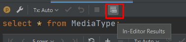

📰 **Topics**

RustのThe book、Duolingoを始めたりと新たな学習開始の週でした。  
Togowlのタスク登録機能も着々と効率化されています。


<!--more-->



<!--toc-->


書いたこと
----------

### 【Rust】The bookの学習メモ 1章~2章

RustのThe bookを読み始めました。



学んだ内容をメモとしてアウトプットしていきたいと思います。

#### 1. Getting Started

WindowsのBuild tools周りで結構手こずりました..。



#### 2. Programming a Guessing Game

乱数を当てるゲームをRustで簡単に実装するハンズオンです。  
簡単なプログラムですが、Rustの大事なポイントが詰まっていて非常にイイです。




読んだこと/聴いたこと
---------------------

### DDD とマイクロサービスと Hack（ytake）

DDDやマイクロサービスなどの設計を現実に照らし合わせたトークがされています。  
とても **あるある** すぎて終始共感の嵐でした！



自分の言葉を使って特に共感した部分は以下です。

* DDDをちゃんとやれば幸せになれる
* フロントエンド(UI含む)にデータベーススキーマが引きずられていて一蓮托生のつらみ
* マイクロサービスは中途半端にやると不幸になる


### 【Python】Python 3.9 Released

正式リリースではなくb5ですけど..Python3.9の新機能について書いてあります。



個人的に気になった変更点は以下2点です。

* `marged_dict = dict_a | dict_b`のような書き方で非破壊的に辞書をマージできる
* `list`や`dict`でジェネリクスが使える

### 糞コードは直すな。

共感しかない内容でした。



気合いを入れてリプレイスだー！..とやると本当に途中でドロップアウトします。  
技術力を駆使して、少しずつ..だが核心を改善していくことが何より大事だと思います。

意味もなく糞コードになったケースはそう多くありません。  
裏側には意味や経緯があり、都度対応を迫られた結果があのような形になっているだけです。

そして、動いており収益を支えている時点でそれは偉大です。  
恨むならコードや作成者ではなく、そうせざる得なかった組織マネジメントを恨むべきでしょう。

### 【Vue】正式リリース前に総予習!! Vue3の変更点まとめ

非常に分かりやすく、ポイントを抑えてまとまっています👏



そろそろVue3が正式リリースされそうなので準備をしておきたいですね😄

### 【Nuxt】Full Static Generationについて

Nuxt2.13から導入されたみたいです。



使ったことないので自信はありませんが、以下のような理解です。

1. 今までのuniversalモードではルーティング先のHTMLを都度取得する
2. その際に`asyncData`や`fetch`を使う
3. `target: static`では`asyncData`や`fetch`をモック化することで、ルーティング先を表示するたびサーバに通信する必要がなくなる

もちろん、動的に変わるコンテンツや認証されたページには向かないと思います。  
私は認証機能付きSPA開発でしか使っていないため、すぐに使うことはなさそう。

### 【Vim】Why Should You Learn Vim in 2020

2020年になぜVimを学ぶべきなのか?  VSCodeを使えればいいのでは..?  
という疑問に対して的確なアンサーを示してくれる記事です。





### 「TODOリスト」は無意味か？効率を上げる条件とは

TODOリストの定義や使い方はピンキリです。  
手段に囚われすぎて目的を見失わないように利用することが大切だと思います。



たとえ予定通りでないとしても、1つでも多くのタスクを終わらせることに意味があります。


試したこと
----------

### Duolingo

英語学習サービスのDuolingoをはじめました。



オススメをされて少しやってみたところ、以下の点が気に入りました。

* 文法をメインにした学習
* 徹底した反復学習と差が分からないほど緩やかな難易度上昇具合
* リスニング/リーディング/ライティング/スピーキング完備
* iPad Proだとすべての機能が使いやすい
* 五感で学習できる

とにかく量をこなし身体全体に染みこませる学習方法です。  
基礎の徹底した反復は何を学ぶにしても大事だと思ってますので👍


### 【IDEA】Database Tools

IntelliJ IDEAで使えるDatabase Toolsを久々に試してみました。



普段はDBeaverを使っています。



IDEAのDatabase Toolsならではの魅力と感じたのは以下です。  
(もしかしたらDBeaverでもできるかもしれませんが..)

* `IdeaVim`でVimのキーバインドが使える
* `Quick Documentation`でテーブル定義と最初の10行が表示される
* エディタの中に結果を表示できる

エディタの中に結果を表示する機能は以下のトグルをONにします。



実行すると、SQL文直下にグラフィカルな結果が表示されます。



他にもIntelliJ IDEAならではと思える機能があってワクワクしますね☺️


調べたこと
----------

### 【Vue】配列の要素を追加/削除/変更してもwatchが発火しない

`{ deep: true }`を指定する必要がありました。

computedは配列の要素に変更があると再計算されますが、watchはされないのですね..。

### 【Vuetify】v-autocompleteの複数選択時に選択されたら選択肢を閉じたい

複数選択できるけど、基本的には1つしか選ばないような場合に必要です。



特にスマホでは開いたままだとUIが占有されてしまい、閉じるのが一手間なのです。  
間違えて『戻る』ボタンを押したらページごと戻ってしまいますし.. 😂

`menu-prop`で指定するobjectの`closeOnContentClick`を`true`にすればOKです。

### 【Jira】Automationが権限エラーで実行できない

課題セキュリティスキームの設定で定義されたセキュリティレベルに対して、`atlassian-addons-project-access`の権限がないからでした。  
プロジェクトロールや権限スキームにはあらかじめ設定されていますが、セキュリティレベルの設定は盲点でした。。




整備したこと
------------

### 【VSCode】テーマをDefault High Contrastに変更

最近はIntelliJ IDEAをメインで使っていることもあり、VSCodeを使う機会は減りました。  
主な利用シーンがデータの閲覧であるため、データ閲覧に適したテーマに変更しました。

こんな感じです。レトロチックでクール！



### git bash依存のプログラムに対応する

ScoopでGitをインストールした場合、インストール場所が標準インストール時と異なります。  
そうすると絶対パスでgit bashを指定したスクリプトが動作しません。

ハードリンクを貼ることでそれを解消しました。

```
Mklink /D "C:\Program Files\Git\bin" "C:\Users\tadashi-aikawa\scoop\apps\git\current\bin"
```

今週のリリース
--------------

### Togowl v2.9.0 ～ v2.11.0



#### タスク追加/編集ダイアログでCtrl+Enterのショートカットキーを追加

タスクの追加や編集がしやすくなりました。



| シーン               | アクション                 |
| -------------------- | -------------------------- |
| タスク追加ダイアログ | 本日の一番上にタスクを作成 |
| タスク編集ダイアログ | 更新                       |

#### ラベルを選択したあと選択メニューを閉じる

ラベルを2つ以上つける機会が少なかったので挙動を変更しました。  
スマホだとメニューを閉じるためのタップが必須でしたが、今後は不要になります。



#### タスクの連続登録

ダイアログを閉じることなく、タスクを登録できます。  
プロジェクトとラベルはそのままに..タスク名はクリアされフォーカスがあたります。

同じプロジェクトのタスクを連続して入力するケースを想定しています。  
私は『`読む(read)`プロジェクトに気になったページのURLを登録するとき』に使っています。




その他
------

最近、目覚ましアラームを使わなくなりました。  
やはりアラームで起こされるのは目覚めが悪く、1日のコンディションに影響するからです。

アラームをやめることで、自分のベストな睡眠時間が少しずつ分かるようになってきました。  
ひとまず、睡眠時間が7時間未満のときはどこかしら不調であるということ。

当面は `22:30(完全就寝) → 5:30(完全起床)` のリズムをベース(理想)にして、睡眠時間が不足しないように起床時間を調整する..という生活になりそうです💪
