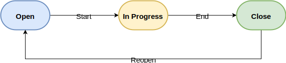

エンジニアはどのように図の管理をするのがベストなのか..。  
[Draw.io]という答えが出ましたので紹介します。

<!--more-->


<!--toc-->


はじめに
--------

エンジニアにとって図を作成するのは日常茶飯事だと思います。  
作成する方法は色々あります.. たとえば..

* PowerPoint
* Google Slide
* Cacoo
* Gliffy
* Visio
* [mermaid]
* [PlantUML]
* ASCII art!!
* Excel!?

とにかく色々あります。

### GUIツールによる管理のメリット/デメリット

GUIツールは直感的で図を描きやすいです。  
しかし、管理面で**作成したツールの保存形式でないとあとから編集しにくい**というデメリットがあります。

バージョン管理面が課題に挙げられることもあります。  
ただ、差分表示にこだわらなければ作成ツールのファイル形式をバイナリ管理することで実現できます。

### テキストによる管理のメリット/デメリット

GUIツールが持つ管理面のデメリットをテキスト管理は解消します。  
[mermaid]や[PlantUML]はテキストを図に変換できるので、見た目もリッチです。

一方でDSLを覚えるのにコストがかかります。  
他にも、細かなレイアウト修正や図の調整はできません。


求める要件
----------

私が図に求める要件は以下です。

|               要件                |       具体的な形式        |
| --------------------------------- | ------------------------- |
| バージョン管理ができる            | Git                       |
| GUIツールで細かな編集ができる     | ???                       |
| ブログで使える                    | [Hugo]                    |
| プレゼンテーション資料で使える    | [backslide]               |
| ドキュメントで使える              | README/[docsify]/[Mkdocs] |

もっとまとめると以下3点です。

* 単一ファイルをバージョン管理 (exportファイルをそのまま編集できる)
* GUIツールで細かな編集
* Markdown/HTMLで表示

そして遂に発見しました！ それが[Draw.io]になります😄


Draw.ioとは
-----------

プロフェッショナルのための図作成ツール/サービスです。



以下の特徴があります。

* オープンソース
* 登録不要
* ブラウザで使える (オンライン) 👈 **オススメ**
  * Google DriveやDropBox、GitHubなどのクラウドストレージで管理
  * 保存がダウンロードになるのをガマンすればローカルストレージも可
* デスクトップアプリとして使える (オフライン)
  * ローカルストレージで保存できる


Draw.ioのメリット
-----------------

以下のURLから試すことができます。



良いと思ったところを1つずつ紹介していきます。

### 開発や発表で作成する図が簡単に書ける

他のどのGUIツールより図の作成に向いているかもしれません😮  
以下は簡単なワークフロー図を作成してみた動画です。



必要な図はほとんど描けてしまう気がしませんか?😉

### SVGファイルを保存/編集できる

ベクターファイルであるSVGは拡大/縮小しても綺麗に表示されます。  
しかも、[Draw.io]で保存したSVGファイルは、いつでも[Draw.io]で編集できます✨

### アイコンなどデータセットが沢山ある

とてもgifでは紹介しきれませんが沢山あります😄



左上の検索窓から検索して、そのまま使うこともできます。  



何のアイコンか分からない場合はHoverすると説明が表示される！ 素晴らしい😭  
SVGアイコンの場合は色の変更も自由自在です😏


作成した図を使う
----------------

HTMLやMarkdownにSVGファイルを貼り付ければOKです。  
先ほど作成したワークフローのSVGを貼り付けてみます。

### Markdownの場合

```markdown

```

実際はこうなります。


### HTMLの場合

```html

```

実際はこうなります。


SVGファイルの中身
-----------------

長いですがこんな感じです。8kbのテキストですね。  
GitHubだとテキストとベクター画像、それぞれで差分確認できますのでGoodです👍

```svg
<?xml version="1.0" encoding="UTF-8"?>
<!DOCTYPE svg PUBLIC "-//W3C//DTD SVG 1.1//EN" "http://www.w3.org/Graphics/SVG/1.1/DTD/svg11.dtd">
<svg xmlns="http://www.w3.org/2000/svg" xmlns:xlink="http://www.w3.org/1999/xlink" version="1.1" width="582px" height="130px" viewBox="-0.5 -0.5 582 130" content="&lt;mxfile host=&quot;Chrome&quot; modified=&quot;2020-01-06T13:19:44.365Z&quot; agent=&quot;Mozilla/5.0 (Windows NT 10.0; Win64; x64) AppleWebKit/537.36 (KHTML, like Gecko) Chrome/79.0.3945.88 Safari/537.36&quot; etag=&quot;uGJP16nFepGbOQfAhGpP&quot; version=&quot;12.4.6&quot; type=&quot;device&quot;&gt;&lt;diagram id=&quot;c3Pi4WBy8xYf2gq6FIK2&quot; name=&quot;Page-1&quot;&gt;1VfBcpswEP0aH5sxYCg5Jo7TdqZuk/rQ5KigBVQLlhFygH59JSMQDI4naaZOevFon1a72n37NHjmLbP6kyBFukYKfObOaT3zrmauGzqe+tVA0wILd94CiWC0hRwLbNhvMGDntmMUypGjROSSFWMwwjyHSI4wIgRWY7cY+ThrQRKYAJuI8Cn6k1GZmrLcjxb/DCxJu8xOcN7uZKRzNpWUKaFYDSBvNfOWAlG2q6xeAte96/rSnrt+Yre/mIBcPufA7W1e7cJNWaz5ekvl9tvFffHBMXU8Er4zFW8kEdJcWTZdH4CqthgThUwxwZzwlUUvBe5yCjrZXFnW5ytioUBHgb9AysZwTHYSFZTKjJtdqJm8G6zvdagz31hXtYm8N5qBcQOCZSBBGCzGXJokjj7d1qILeLJzBipxJyI41q6FGUEiEpDHHP2eYaUMQHU/0aiDAjiR7HF8E2JmNOn9LI1qYZh8CauLCavfC8gnpJZS4Lafa3dMh5rXQvtldaKVfRZzrKJUzcaZanXGciJRdfyySpmETUH2fauUp2aAcb5ErvdVGo8SCONIh9znG+wEUQgP8QHO9ra5qOnSIwgJ9XEKpw3vDsyNCs0zdG7Mymq6d0kHeg7m/4qicELRKqf/s+wUE6K5GxqDSNq0ofZWM7ROqWH/uRoO3lTD/mRAvigFz28EJgLK8q3EHMexGx0UMw0eAj84gZi9xXsT8/mEqx+Ah17cE+rZavh+sPM3erYS7iO9Jz0Hz9Xz4pV63h+9EII0A4cCWS7LQeQbDdhhDbzxsHZfttdP+Dv+UX+1aG9gp7Uv5RUDHEwGeMmxhDf7YvAhpItDj0zoPnjBKR4ZPzzZI6NM+zegpdT+l/JWfwA=&lt;/diagram&gt;&lt;/mxfile&gt;"><defs/><g><path d="M 101 31 L 234.63 31" fill="none" stroke="#000000" stroke-miterlimit="10" pointer-events="none"/><path d="M 239.88 31 L 232.88 34.5 L 234.63 31 L 232.88 27.5 Z" fill="#000000" stroke="#000000" stroke-miterlimit="10" pointer-events="none"/><g transform="translate(154.5,22.5)"><switch><foreignObject style="overflow:visible;" pointer-events="none" width="32" height="16" requiredFeatures="http://www.w3.org/TR/SVG11/feature#Extensibility"><div xmlns="http://www.w3.org/1999/xhtml" style="display:inline-block;font-size:15px;font-family:Helvetica;color:#000000;line-height:1.2;vertical-align:top;white-space:nowrap;text-align:center;"><div xmlns="http://www.w3.org/1999/xhtml" style="display:inline-block;text-align:inherit;text-decoration:inherit;background-color:#ffffff;">Start</div></div></foreignObject><text x="16" y="16" fill="#000000" text-anchor="middle" font-size="15px" font-family="Helvetica">Start</text></switch></g><path d="M 31.61 1 L 70.39 1 C 87.29 1 101 14.43 101 31 C 101 47.57 87.29 61 70.39 61 L 31.61 61 C 14.71 61 1 47.57 1 31 C 1 14.43 14.71 1 31.61 1 Z" fill="#dae8fc" stroke="#6c8ebf" stroke-width="2" stroke-miterlimit="10" pointer-events="none"/><g transform="translate(30.5,22.5)"><switch><foreignObject style="overflow:visible;" pointer-events="none" width="39" height="16" requiredFeatures="http://www.w3.org/TR/SVG11/feature#Extensibility"><div xmlns="http://www.w3.org/1999/xhtml" style="display: inline-block; font-size: 15px; font-family: Helvetica; color: rgb(0, 0, 0); line-height: 1.2; vertical-align: top; width: 39px; white-space: nowrap; overflow-wrap: normal; font-weight: bold; text-align: center;"><div xmlns="http://www.w3.org/1999/xhtml" style="display:inline-block;text-align:inherit;text-decoration:inherit;white-space:normal;">Open</div></div></foreignObject><text x="20" y="16" fill="#000000" text-anchor="middle" font-size="15px" font-family="Helvetica" font-weight="bold">Open</text></switch></g><path d="M 341 31 L 474.63 31" fill="none" stroke="#000000" stroke-miterlimit="10" pointer-events="none"/><path d="M 479.88 31 L 472.88 34.5 L 474.63 31 L 472.88 27.5 Z" fill="#000000" stroke="#000000" stroke-miterlimit="10" pointer-events="none"/><g transform="translate(397.5,22.5)"><switch><foreignObject style="overflow:visible;" pointer-events="none" width="27" height="16" requiredFeatures="http://www.w3.org/TR/SVG11/feature#Extensibility"><div xmlns="http://www.w3.org/1999/xhtml" style="display:inline-block;font-size:15px;font-family:Helvetica;color:#000000;line-height:1.2;vertical-align:top;white-space:nowrap;text-align:center;"><div xmlns="http://www.w3.org/1999/xhtml" style="display:inline-block;text-align:inherit;text-decoration:inherit;background-color:#ffffff;">End</div></div></foreignObject><text x="14" y="16" fill="#000000" text-anchor="middle" font-size="15px" font-family="Helvetica">End</text></switch></g><path d="M 271.61 1 L 310.39 1 C 327.29 1 341 14.43 341 31 C 341 47.57 327.29 61 310.39 61 L 271.61 61 C 254.71 61 241 47.57 241 31 C 241 14.43 254.71 1 271.61 1 Z" fill="#fff2cc" stroke="#d6b656" stroke-width="2" stroke-miterlimit="10" pointer-events="none"/><g transform="translate(248.5,22.5)"><switch><foreignObject style="overflow:visible;" pointer-events="none" width="83" height="16" requiredFeatures="http://www.w3.org/TR/SVG11/feature#Extensibility"><div xmlns="http://www.w3.org/1999/xhtml" style="display: inline-block; font-size: 15px; font-family: Helvetica; color: rgb(0, 0, 0); line-height: 1.2; vertical-align: top; width: 83px; white-space: nowrap; overflow-wrap: normal; font-weight: bold; text-align: center;"><div xmlns="http://www.w3.org/1999/xhtml" style="display:inline-block;text-align:inherit;text-decoration:inherit;white-space:normal;">In Progress</div></div></foreignObject><text x="42" y="16" fill="#000000" text-anchor="middle" font-size="15px" font-family="Helvetica" font-weight="bold">In Progress</text></switch></g><path d="M 531 61 L 531 121 L 51 121 L 51 67.37" fill="none" stroke="#000000" stroke-miterlimit="10" pointer-events="none"/><path d="M 51 62.12 L 54.5 69.12 L 51 67.37 L 47.5 69.12 Z" fill="#000000" stroke="#000000" stroke-miterlimit="10" pointer-events="none"/><g transform="translate(264.5,112.5)"><switch><foreignObject style="overflow:visible;" pointer-events="none" width="53" height="16" requiredFeatures="http://www.w3.org/TR/SVG11/feature#Extensibility"><div xmlns="http://www.w3.org/1999/xhtml" style="display:inline-block;font-size:15px;font-family:Helvetica;color:#000000;line-height:1.2;vertical-align:top;white-space:nowrap;text-align:center;"><div xmlns="http://www.w3.org/1999/xhtml" style="display:inline-block;text-align:inherit;text-decoration:inherit;background-color:#ffffff;">Reopen</div></div></foreignObject><text x="27" y="16" fill="#000000" text-anchor="middle" font-size="15px" font-family="Helvetica">Reopen</text></switch></g><path d="M 511.61 1 L 550.39 1 C 567.29 1 581 14.43 581 31 C 581 47.57 567.29 61 550.39 61 L 511.61 61 C 494.71 61 481 47.57 481 31 C 481 14.43 494.71 1 511.61 1 Z" fill="#d5e8d4" stroke="#82b366" stroke-width="2" stroke-miterlimit="10" pointer-events="none"/><g transform="translate(509.5,22.5)"><switch><foreignObject style="overflow:visible;" pointer-events="none" width="41" height="16" requiredFeatures="http://www.w3.org/TR/SVG11/feature#Extensibility"><div xmlns="http://www.w3.org/1999/xhtml" style="display: inline-block; font-size: 15px; font-family: Helvetica; color: rgb(0, 0, 0); line-height: 1.2; vertical-align: top; width: 41px; white-space: nowrap; overflow-wrap: normal; font-weight: bold; text-align: center;"><div xmlns="http://www.w3.org/1999/xhtml" style="display:inline-block;text-align:inherit;text-decoration:inherit;white-space:normal;">Close</div></div></foreignObject><text x="21" y="16" fill="#000000" text-anchor="middle" font-size="15px" font-family="Helvetica" font-weight="bold">Close</text></switch></g></g></svg>
```


トラブルシューティング
----------------------

### 外部画像を取り入れたら表示されない

たとえばこんな図を作ります。

<object type="image/svg+xml" data="20200106_2.svg"></object>

HTMLやMarkdownに埋め込んで確認してみると.. 一部の画像が表示されません。


これはHTMLのimgタグでsvgを表すると、svgのimageタグ属性`xlink:href`が有効にならないからです。  
私はしっかり理解できていませんが、以下の記事が参考になりました。



回避策は2つあります。

#### 画像をbase64エンコードでSVGファイルに埋め込む

ファイルサイズは肥大してしまいますが、1ファイルに納められます。  
ただし、デスクトップアプリでは未対応でした。

#### `<object>`タグを使う

外部参照を可能にするためファイルサイズを抑えられます。

下記のように記述します。

```html
<object type="image/svg+xml" data="20200106_2.svg"></object>
```

デスクトップアプリで作成したSVGファイルは、URLが相対パスになっていたのでそのままでは使えませんでした。  
ブラウザアプリで作成したとき埋め込まれる絶対URLにする必要があります。


総括
----

エンジニアにとって図を管理するベストなソリューションとして[Draw.io]を紹介しました。

個人的にはブラウザ版を使ってSVGファイルで編集し、`<object>`タグから参照するのがオススメです。

[Draw.io]: https://about.draw.io/
[PlantUML]: https://plantuml.com/
[mermaid]: https://plantuml.com/
[Hugo]: https://gohugo.io/
[backslide]: https://github.com/sinedied/backslide
[docsify]: https://docsify.js.org/#/
[Mkdocs]: https://www.mkdocs.org/
