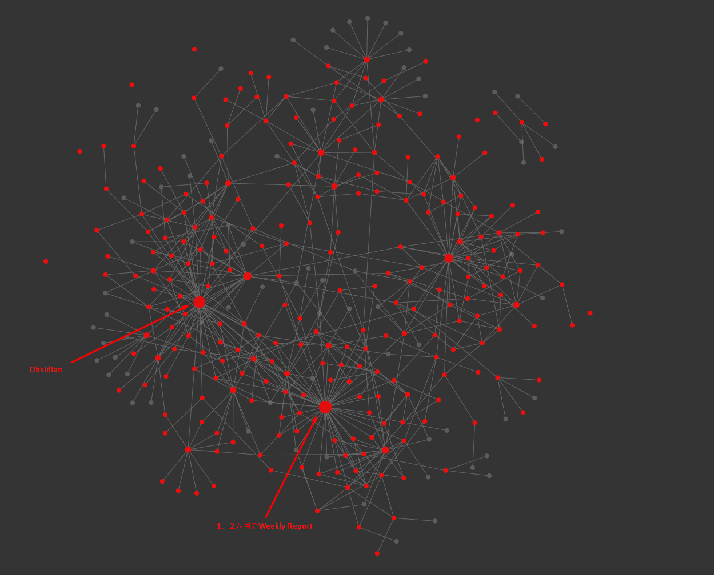

今年からナレッジ管理を[Obsidian]に移行してみました。

<!--more-->



<!--toc-->

Obsidianとは
------------

ローカルで知識ベースを管理するアプリケーションです。



情報はすべてMarkdownで管理できるため、ポータビリティが高いという特徴もあります。


Obsidianに移行したきっかけ
--------------------------

### 出会い

[Obsidian]をはじめて知ったのは以下のブログでした。



これを読んだ時点ではまだ移行しようと思いませんでした。  
というのも現状の環境に満足していたからです。

- IntelliJ IDEAでのMarkdown編集が快適だった
  - 他エディタを使うとVim周りや設定管理が不安
- Hugoによるブログ執筆に不満はなかった
- Mkdocsによるサイト管理に大きな不満はなかった

### 転換期

大きなきっかけは友人のブログでした。



彼が気になっているのなら自分も是非試してみたいなと。  
きっかけとはいつになっても些細なものですね。


なぜObsidianに移行したのか
--------------------------

きっかけだけでは移行するには至りません。  
移行を決断した大きな理由を3つ紹介します。

### LYTという思想に深く共感したから

LYT(Linking Your Thinking)は最近Nick Milo氏が考案したフレームワークです。  
100年近く前に考えられた[Zettelkasten]というメソッドを、デジタルツールに反映させるため考案されました。



[LYT]を知ったきっかけは以下のブログでした。



まとめを引用させていただくと雰囲気が伝わるのではないでしょうか。

> * LYTはZettelkastenをデジタルで上手に扱えるようにした枠組み
> * 1ノート1要素の「BOATノート」をじっくりと育てていく（1要素 = Atomと表現されている）
> * デジタルガーデン、という概念
> * 十分に育ったノートは「エバーグリーンノート」
> * このノートをたくさん作り上げることで、執筆が「エバーグリーンノートの編集」で大体済ませられるようになる。
> * これらのノートを繋ぐために使うのが「MOC」（Map of Contents）というノート。
> * MOCはフォルダのような階層を持つものでなく、自由に、どんな形式でも整理できる
> * MOCも「常に変化し続ける」前提で作る
> * MOCがあれば超大規模なノート群も自在に行き来ができる
> * ノートが100を超えるくらいからMOCを意識
> * 「HOME」となるMOCを作って、それを作り上げていく

かねてより『ドキュメンテーションもプロダクト開発と同じ』と考えていたので、これらの言葉1つ1つに興奮を覚えずにはいられませんでした。

#### My PKM Story

そして、[LYT]を発明したNick Milo氏のストーリーを読んで決意しました。  
『[LYT]と共に生きていこう』と。



書けば書くほど楽しさが増すノート.. なんとも甘美な響きです🍰

### Obsidianを紹介する記事がどれも素晴らしかったから

1つの意見を鵜呑みにして、今まで培った知識ベースの引っ越しをするわけにはいきません。  
当然、色々なサイトやpodcastを見聞してきました。

いずれのサイトでも[Obsidian]は絶賛されており、その著者の方が**私と同じような思想を持っていそうだった**ということもかなりのポイントでした。  
新しい技術なこともあり、薄っぺらい紹介は皆無.. すべての記事に愛を感じました💓

いくつかご紹介します。

#### メモを集約しても死蔵させないアプリObsidian

ストックメモとフローメモについて触れ、死蔵しないメモを集約する方法について書かれた記事。



特に**ゲームチェンジャー**というワードにグッときました。

> Obsidianも同様に、ストックとフローを分けるシステムがあるわけではありません。
> しかし、リンクとgraph viewグラフビューはゲームチェンジャーです。

こればかりは理屈ではありません。実際に触ってみないと分からないと思います。  
私の場合は1週間ほど使い始めたときに気付きました。『あ、これは面白い』と。

#### Zenn & Hugo in Obsidian : OHZフローによるナレッジベースとアウトプットコンテンツの完全統括

[Obsidian]と[Zenn]や[Hugo]を共存させた独自のOHZフローについて説明された記事。



[Obsidian]導入前の私と技術スタックが酷似していたため、とても背中を押されました。  
私が整理したいと思っていたフローもOHZフローとして紹介されていたので余計に🤗

もう少ししたら、ふりかえりの意味もこめてじっくり読ませていただくつもりです。

#### メモアプリObsidianでnoteをシステマチックに書く方法

[Obsidian]を使ってメモから記事に昇華させるテクニックが紹介された記事。  
この記事でかなり具体的なイメージが沸いてきました。



記事では『ブログの編集プラットフォームへ転記する前に極力体裁を整える』旨が書かれていますが、今のところ私はブログの構成決めには[Obsidian]を使っていません。  
[Obsidian]はネタの引き出しとして利用し、記事作成はすべて[Hugo]を使っています。

ブログの記事は**あくまでその時点のスナップショットに過ぎないから**という考えに基づいた結果ですが、しばらく運用して気が変わる可能性はあります。

### ローカルでの動作が速く快適だったから

実は[LYT]のような概念に一度取り組んでみようと思ったタイミングがあります。  
世間で[Scrapbox]が流行りだしたときです。一度は試してみました。

しかし以下の理由からメリットを享受する前にやめてしまいました。

- Markdown形式がサポートされていない
- Vimキーバインドがサポートされていない
- スマホからだと非常に重い (編集はおろか閲覧さえも)

私はすべてのことにおいてスピードというものをとても重視します。  
そのため、上に挙げた3つの制約はクリティカルでした。

しかし[Obsidian]は違いました！

- Markdown形式がサポートされている
- Vimキーバインドがサポートされている
- ローカルで動作して高速 (ただしスマホでは編集できない)

特にVimプラグインの公式サポートは、他のメモ/ドキュメンテーション専用アプリにはない完成度でした。

その他、[Obsidian]を快適にするための設定は後ほどご紹介させてください😳


Obsidianのカスタマイズ
----------------------

[Obsidian]の紹介については公式サイトや先人の素晴らしい記事をご覧ください。  
本記事では設定のカスタマイズについてご紹介していきます。

少々マニアックな内容になりますが、ここまで記事をご覧になった方であれば問題ないかと😁

### Vimの環境を整備したい

設定で`Editor` > `Vim key bindings`をONにするだけです。  
しかし、これだけでは不便な点がありますので解消しましょう。

#### .vimrcを読み込みたい

obsidian-vimrc-supportのコミュニティプラグインを使います。



valutのルート配下に`.obsidian.vimrc`を作成すればOKです。

#### yankとクリップボードを同期したい

デフォルトではyankとクリップボードが同期していないため非常に不便です。  
`.obsidian.vimrc`に`set clipboard=unnamed`を記載することで同期されます。


上記はWindowsの場合です


#### `di]`のようなtext objectを使いたい

Add Codemirror matchbrackets.jsプラグインを使いましょう。



[Obsidian]では`[[hoge]]`のような表記を多用するため必需品ですね。

### テーブルをフォーマットしたい

Advanced Tables for Obsidianプラグインを使いましょう。



編集しながらフォーマットされている動きをします。

### Ctrl+Tabでタブ移動したい

Cycle through Panesプラグインを使いましょう。



### ページ内の見出しにジャンプしたい

Quick Switcher++プラグインの`Open in Symbol Mode`を使いましょう。



ただし、見出しレベルによる階層表示はできません。  
階層把握が目的なら`Open outline`でアウトラインを常時表示しましょう。

### 絵文字を入力したい

Emoji Toolbarプラグインを使いましょう。



### 2キーバインドを設定したい

私は`Ctrl + j`を押してから`k`を押す..のようなキーバインドを愛用しています。  
しかし、[Obsidian]はこの設定ができなそうでした。

[AutoHotKey]を使ってこのワガママを実現してしまいましょう。

#### Ctrl+jの押下判定

直前に`Ctrl+j`が押されたかどうかの判定関数を作ります。

```autohotkey
;【概要】現在押下されているキーがCtrl+jの後に押されたものかを返します。
;【引数】なし
;【戻値】true: 押されている
isSecondKeyAfterCtrlJ() {
    return (A_PriorHotKey = "$^j")
}
```

#### Obsidianがアクティブか判定

指定したプロセスがアクティブになっているかを判定する関数を作成します。

```autohotkey
;【概要】指定されたプロセスがアクティブであるか
;【引数】name: プロセス名
;【戻値】true / false
isActiveProcess(name) {
    WinGet, ahk_process, ProcessName, A
    if (ahk_process == name) {
        return true
    } else {
        return false
    }
}
```

#### ObsidianがアクティブなときはCtrl+jをprefix keyとして判定

まず、[Obsidian]がアクティブなときは`Ctrl + j`を無効化します。  
しかし、`A_PriorHotKey`にはしっかりと記録されます。

```autohotkey
$^j::
    if (isActiveProcess("Obsidian.exe")) {
        // DO NOTHING
    }
    ; 以下略
```

`Ctrl + j`のあとに割り当てるキーのイベントで`isSecondKeyAfterCtrlJ()`を使って処理を変えましょう。

```autohotkey
$f::
    if (isActiveProcess("Obsidian.exe") && isSecondKeyAfterCtrlJ()) {
        ;ObsidianでCtrl + Jのあとなら以下を実行
    } else {
        ; 以下略
```


Owl Brainについて
-----------------

[Obsidian]でまとめた内容の一部はpublishして公開しています。



publishは有料ですが、今なら半額の`月8$`です。  
簡単にアップロードができ[Obsidian]の情報をフルに引き出せるのでオススメです。


JCBカードでは購読できなかったのでVISAを使いました。


### Graph view

今のGraph viewはこんな感じです。  



Daily ReportやWeekly Report込みですが、[Obsidian]に関する情報が多めですね。


総括
----

ナレッジ管理を[Obsidian]に移行した理由と、主なカスタマイズ内容について紹介しました。

使い始めてから半月程度ということもあり、まだまだ修行中の身です。  
ただ、自分なりの使い方が段々と固まりつつあることを実感しています。

まだ紹介したいこと..ありますが、量が多くなりすぎるため今回はカットします。  
今後以下のような記事を執筆したいと考えています。

- Obsidianを1ヶ月使ってみた
- 私のナレッジマネジメント戦略
- テーマのカスタマイズ
- ディレクトリとタグの利用価値
- Obsidianのプラグインを作ってみた (ら書きます)

最後に.. 皆さんも是非騙されたと思ってObsidianを使ってみてください..!!  
きっと、日々の学びが深く楽しいものになると思いますよ😉

[Obsidian]: https://obsidian.md/
[Zettelkasten]: https://en.wikipedia.org/wiki/Zettelkasten
[Scrapbox]: https://scrapbox.io/
[LYT]: https://publish.obsidian.md/lyt-kit/LYT+About
[Zenn]: https://zenn.dev/
[Hugo]: https://gohugo.io/
[AutoHotKey]: https://www.autohotkey.com/:w

